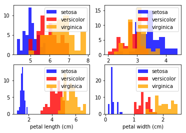
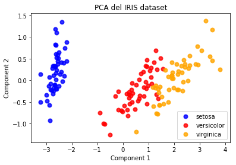
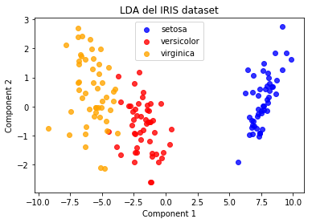
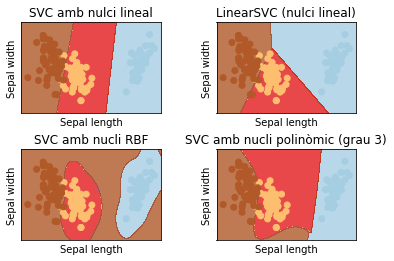
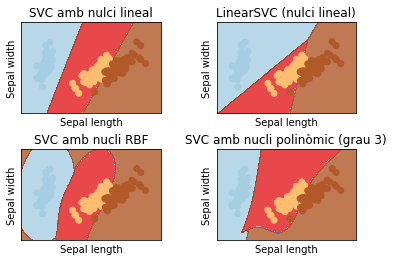
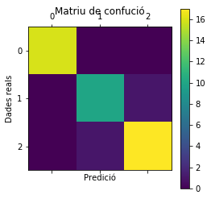
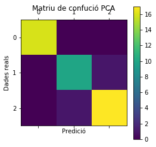
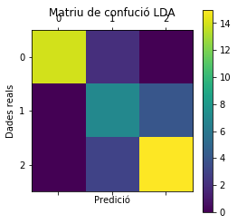

<div style="width: 100%; clear: both;">
<div style="float: left; width: 50%;">

</div>
<div style="float: right; width: 50%;">
<p style="margin: 0; padding-top: 22px; text-align:right;">M2.955 · Models avançats de mineria de dades · PAC1</p>
<p style="margin: 0; text-align:right;">2017-2 · Màster universitari en Ciència de dades (Data science)</p>
<p style="margin: 0; text-align:right; padding-button: 100px;">Estudis de Informàtica, Multimèdia i Telecomunicacions</p>
</div>
</div>
<div style="width:100%;">&nbsp;</div>


# PAC 1: Preparació de dades

Al llarg d'aquesta pràctica veurem com aplicar diferents tècniques per a la càrrega i preparació de dades:

1. ** Càrrega de conjunts de dades **
- ** Anàlisi exploratòria de dades **
- ** Reducció de dimensionalitat **
   
Per a això necessitarem les següents llibreries:


```python
from sklearn import svm, datasets
from sklearn import preprocessing
from sklearn.decomposition import PCA
from sklearn.discriminant_analysis import LinearDiscriminantAnalysis
from sklearn.model_selection import train_test_split
from sklearn.tree import DecisionTreeClassifier
from sklearn.metrics import accuracy_score
from sklearn.metrics import confusion_matrix
from mpl_toolkits.mplot3d import Axes3D

import matplotlib.pyplot as plt
import pandas as pd
import numpy as np
```

# Exercici 1 (10%). Càrrega del conjunt de dades

En primer lloc, haureu de carregar el conjunt de dades IRIS dataset (Més informació a https://archive.ics.uci.edu/ml/datasets/iris). Aquest conjunt es pot descarregar d'Internet o es pot carregar directament de la llibreria "scikit-learn", que incorpora un conjunt de datasets molt coneguts i emprats per mineria de dades i machine learning.

Un cop tingueu el conjunt carregat, feu una anàlisi estadística bàsica indicant, per a cada atribut del conjunt de dades, el seu valor mitjà i variància. Mostreu i comenteu els resultats.


```python
iris = datasets.load_iris()

# assignenmt i normalitzem les dades
X = iris.data
y = iris.target
target_names = iris.target_names
```

Despres de carregar directament el dataset de paquet sklearn en la variable "iris", realitzem una comprobació de les dades.


```python
print('Classes (Species):')
print(target_names)

dataset = pd.DataFrame(data= np.c_[iris['data'], iris['target']],
                     columns= iris['feature_names'] + ['target'])
dataset.head(20)

```

    Classes (Species):
    ['setosa' 'versicolor' 'virginica']


<div>
<table border="1" class="dataframe">
  <thead>
    <tr style="text-align: right;">
      <th></th>
      <th>sepal length (cm)</th>
      <th>sepal width (cm)</th>
      <th>petal length (cm)</th>
      <th>petal width (cm)</th>
      <th>target</th>
    </tr>
  </thead>
  <tbody>
    <tr>
      <th>0</th>
      <td>5.1</td>
      <td>3.5</td>
      <td>1.4</td>
      <td>0.2</td>
      <td>0.0</td>
    </tr>
    <tr>
      <th>1</th>
      <td>4.9</td>
      <td>3.0</td>
      <td>1.4</td>
      <td>0.2</td>
      <td>0.0</td>
    </tr>
    <tr>
      <th>2</th>
      <td>4.7</td>
      <td>3.2</td>
      <td>1.3</td>
      <td>0.2</td>
      <td>0.0</td>
    </tr>
    <tr>
      <th>3</th>
      <td>4.6</td>
      <td>3.1</td>
      <td>1.5</td>
      <td>0.2</td>
      <td>0.0</td>
    </tr>
    <tr>
      <th>4</th>
      <td>5.0</td>
      <td>3.6</td>
      <td>1.4</td>
      <td>0.2</td>
      <td>0.0</td>
    </tr>
    <tr>
      <th>5</th>
      <td>5.4</td>
      <td>3.9</td>
      <td>1.7</td>
      <td>0.4</td>
      <td>0.0</td>
    </tr>
    <tr>
      <th>6</th>
      <td>4.6</td>
      <td>3.4</td>
      <td>1.4</td>
      <td>0.3</td>
      <td>0.0</td>
    </tr>
    <tr>
      <th>7</th>
      <td>5.0</td>
      <td>3.4</td>
      <td>1.5</td>
      <td>0.2</td>
      <td>0.0</td>
    </tr>
    <tr>
      <th>8</th>
      <td>4.4</td>
      <td>2.9</td>
      <td>1.4</td>
      <td>0.2</td>
      <td>0.0</td>
    </tr>
    <tr>
      <th>9</th>
      <td>4.9</td>
      <td>3.1</td>
      <td>1.5</td>
      <td>0.1</td>
      <td>0.0</td>
    </tr>
    <tr>
      <th>10</th>
      <td>5.4</td>
      <td>3.7</td>
      <td>1.5</td>
      <td>0.2</td>
      <td>0.0</td>
    </tr>
    <tr>
      <th>11</th>
      <td>4.8</td>
      <td>3.4</td>
      <td>1.6</td>
      <td>0.2</td>
      <td>0.0</td>
    </tr>
    <tr>
      <th>12</th>
      <td>4.8</td>
      <td>3.0</td>
      <td>1.4</td>
      <td>0.1</td>
      <td>0.0</td>
    </tr>
    <tr>
      <th>13</th>
      <td>4.3</td>
      <td>3.0</td>
      <td>1.1</td>
      <td>0.1</td>
      <td>0.0</td>
    </tr>
    <tr>
      <th>14</th>
      <td>5.8</td>
      <td>4.0</td>
      <td>1.2</td>
      <td>0.2</td>
      <td>0.0</td>
    </tr>
    <tr>
      <th>15</th>
      <td>5.7</td>
      <td>4.4</td>
      <td>1.5</td>
      <td>0.4</td>
      <td>0.0</td>
    </tr>
    <tr>
      <th>16</th>
      <td>5.4</td>
      <td>3.9</td>
      <td>1.3</td>
      <td>0.4</td>
      <td>0.0</td>
    </tr>
    <tr>
      <th>17</th>
      <td>5.1</td>
      <td>3.5</td>
      <td>1.4</td>
      <td>0.3</td>
      <td>0.0</td>
    </tr>
    <tr>
      <th>18</th>
      <td>5.7</td>
      <td>3.8</td>
      <td>1.7</td>
      <td>0.3</td>
      <td>0.0</td>
    </tr>
    <tr>
      <th>19</th>
      <td>5.1</td>
      <td>3.8</td>
      <td>1.5</td>
      <td>0.3</td>
      <td>0.0</td>
    </tr>
  </tbody>
</table>
</div>


Observem els seguent atributs:

* Longitud del sèpal en cm (Sepal.Length)
* Ample del sèpal en cm (Sepal.Width)
* Longitud del pépalo en cm (Petal.Length)
* Ample del pépalo en cm (Pepal.Width)

Classe (Species):
* Setosa
* Versicolour
* Virginica

Fem una anàlisi estadística bàsica indicant, per a cada atribut del conjunt de dades, el seu valor mitjà i variància.


```python
dataset.describe()
```


<div>
<table border="1" class="dataframe">
  <thead>
    <tr style="text-align: right;">
      <th></th>
      <th>sepal length (cm)</th>
      <th>sepal width (cm)</th>
      <th>petal length (cm)</th>
      <th>petal width (cm)</th>
      <th>target</th>
    </tr>
  </thead>
  <tbody>
    <tr>
      <th>count</th>
      <td>150.000000</td>
      <td>150.000000</td>
      <td>150.000000</td>
      <td>150.000000</td>
      <td>150.000000</td>
    </tr>
    <tr>
      <th>mean</th>
      <td>5.843333</td>
      <td>3.054000</td>
      <td>3.758667</td>
      <td>1.198667</td>
      <td>1.000000</td>
    </tr>
    <tr>
      <th>std</th>
      <td>0.828066</td>
      <td>0.433594</td>
      <td>1.764420</td>
      <td>0.763161</td>
      <td>0.819232</td>
    </tr>
    <tr>
      <th>min</th>
      <td>4.300000</td>
      <td>2.000000</td>
      <td>1.000000</td>
      <td>0.100000</td>
      <td>0.000000</td>
    </tr>
    <tr>
      <th>25%</th>
      <td>5.100000</td>
      <td>2.800000</td>
      <td>1.600000</td>
      <td>0.300000</td>
      <td>0.000000</td>
    </tr>
    <tr>
      <th>50%</th>
      <td>5.800000</td>
      <td>3.000000</td>
      <td>4.350000</td>
      <td>1.300000</td>
      <td>1.000000</td>
    </tr>
    <tr>
      <th>75%</th>
      <td>6.400000</td>
      <td>3.300000</td>
      <td>5.100000</td>
      <td>1.800000</td>
      <td>2.000000</td>
    </tr>
    <tr>
      <th>max</th>
      <td>7.900000</td>
      <td>4.400000</td>
      <td>6.900000</td>
      <td>2.500000</td>
      <td>2.000000</td>
    </tr>
  </tbody>
</table>
</div>


Hi ha unes 150 observacions amb diferents escales de valors i que per a tots els atributs, pel que fa a l'atribut sepal-with hi ha outliers gairebé al doble de la distància de la mitjana.

# Exercici 2 (30%). Anàlisis exploratori de les dades

Utilitzant una llibreria gràfica, com ara "matplotlib", feu un gràfic de l'histograma de valors per a cada un dels atributs, separats pels valors de classe. La finalitat és observar com es distribueix cada un dels atributs en funció del valor de classe que prenen, per poder identificar de forma visual i ràpida si alguns atributs permeten diferenciar de forma clara les diferents classes que formen aquest conjunt de dades.

Mostreu les diferents visualitzacions (una per a cada atribut) i comenteu breument els resultats obtinguts.


```python
fig, axes = plt.subplots(nrows= 2, ncols=2)
colors= ['blue', 'red', 'orange']

for i, ax in enumerate(axes.flat):
    for label, color in zip(range(len(iris.target_names)), colors):
        ax.hist(iris.data[iris.target==label, i], label=             
                            iris.target_names[label], color=color,  alpha=0.8)
        ax.set_xlabel(iris.feature_names[i])  
        ax.legend(loc='upper right')

plt.show()
```





Distingim els valors dels atributs de classe, superposant, agrupant i identificar els valors. Podem observar que, excepte l'atribut sepal-with, els altres gairebé es poden detectar per agrupació "i predir" l'atribut categòric class.

Com hem comentat anteriorment, l'atribut que té les observacions de la mostra més a prop de la mitjana és el sepal-witdh. La resta d'atributs disposen d'observacions allunyades de la mitjana, i les observacions estan distribuïdes de manera no uniforme, per tant no són distribucions gaussianes.


# Exercici 3 (30%). Reducció de la dimensionalitat

En aquest exercici haureu aplicar dos (o més) mètodes de reducció de dimensionalitat al conjunt original de dades. L'objectiu és reduir el conjunt d'atributs a un nou conjunt de 2 dimensions (en lloc de les 4 que té el conjunt original).

Podeu aplicar, entre d'altres:
- Principal Component Analysis (PCA)
- Linear discriminant Analysis (LDA)

No cal que programeu els algoritmes, i podeu fer ús de les implementacions disponibles a la llibreria "scikit-learn".

Genereu un gràfic (en 2D) amb el resultat de cadascun dels mètodes de reducció de la dimensió, amb l'objectiu de visualitzar si és possible separar eficientment les classes objectiu emprant aquests mètodes de reducció de dimensionalitat. Comenteu els resultats obtinguts.

## Principal Component Analysis (PCA)

L'Anàlisi de components principals (PCA) aplicada a aquestes dades identifica la combinació d'atributs (components principals a l'espai de característiques) que expliquen la major variació de les dades. Aquí dibuixem les diferents mostres dels 2 primers components principals.

L'algorime realiza la mitjana de cada atribut, calcula la matriu de covarianza de les dades, despres calcula els valors i vectors propis de la matriu de covarianza i ordena els factor y projeccións de les dades en l'espai PCA.


```python
pca = PCA(n_components=2)

# Estandarizem les dades
X_r = pca.fit(X).transform(X)

# Percentatge de variància explicat per a cada component
print('Explicació de la relació de variància (dos primers components): %s'
      % str(pca.explained_variance_ratio_))

plt.figure()
colors = ['blue', 'red', 'orange']
lw = 2

# graficando el dataset reducido a 2 componenetes
for color, i, target_name in zip(colors, [0, 1, 2], target_names):
    plt.scatter(X_r[y == i, 0], X_r[y == i, 1], color=color, alpha=.8, lw=lw,
                label=target_name)
plt.legend(loc='best', shadow=False, scatterpoints=1)
plt.xlabel('Component 1')
plt.ylabel('Component 2')
plt.title('PCA del IRIS dataset')
plt.show()

```

    Explicació de la relació de variància (dos primers components): [ 0.92461621  0.05301557]





Podemos veure que el primer discriminant lineal explica més del 92% de la variància entre grups.


```python
# matriu d'identitat, normalitzem les dades
i = np.identity(X.shape[1])
print(i)
```

    [[ 1.  0.  0.  0.]
     [ 0.  1.  0.  0.]
     [ 0.  0.  1.  0.]
     [ 0.  0.  0.  1.]]


```python
datasetPCA = pd.DataFrame(pca.components_,columns=iris['feature_names'],index = ['PC-1','PC-2'])
datasetPCA
```


<div>
<table border="1" class="dataframe">
  <thead>
    <tr style="text-align: right;">
      <th></th>
      <th>sepal length (cm)</th>
      <th>sepal width (cm)</th>
      <th>petal length (cm)</th>
      <th>petal width (cm)</th>
    </tr>
  </thead>
  <tbody>
    <tr>
      <th>PC-1</th>
      <td>0.36159</td>
      <td>-0.082269</td>
      <td>0.856572</td>
      <td>0.358844</td>
    </tr>
    <tr>
      <th>PC-2</th>
      <td>0.65654</td>
      <td>0.729712</td>
      <td>-0.175767</td>
      <td>-0.074706</td>
    </tr>
  </tbody>
</table>
</div>


Podem veure la matriu de covariancia per veure quins son els 2 atributs mes coecionats, en aquest cas sepa-width 79% y el petal-length 85% son els que mes valor tenen.

## Linear discriminant Analysis (LDA)

L'anàlisi discriminant (LDA) és una tècnica per tractar de trobar les variables que permeten diferenciar als grups i quantes d'aquestes variables són necessàries per aconseguir la millor classificació possible. La pertinença als grups, coneguda per endavant, s'utilitza com a variable depenent (una variable categòrica amb tants valors discrets com a grups). Les variables en les quals suposem que es diferencien els grups s'utilitzen com a variables independents o variables de classificació (variables discriminants).

L'objectiu de l'anàlisi discriminant és trobar la combinació lineal de les variables discriminants que millor permeti diferenciar (discriminar) als grups. Una vegada trobada aquesta combinació (la funció discriminant) podrà ser utilitzada per classificar nous casos. Es tracta d'una tècnica d'anàlisi multivariante capaç d'aprofitar les relacions existents entre una gran quantitat de variables independents per maximitzar la capacitat de discriminació.


```python
lda = LinearDiscriminantAnalysis(n_components=2)

lda = lda.fit(X, y) 

pd.DataFrame(preprocessing.normalize(lda.scalings_),index=iris['feature_names'],columns = ['PC-1','PC-2'])
```


<div>
<table border="1" class="dataframe">
  <thead>
    <tr style="text-align: right;">
      <th></th>
      <th>PC-1</th>
      <th>PC-2</th>
    </tr>
  </thead>
  <tbody>
    <tr>
      <th>sepal length (cm)</th>
      <td>0.999197</td>
      <td>0.040076</td>
    </tr>
    <tr>
      <th>sepal width (cm)</th>
      <td>0.583431</td>
      <td>0.812163</td>
    </tr>
    <tr>
      <th>petal length (cm)</th>
      <td>-0.920081</td>
      <td>-0.391728</td>
    </tr>
    <tr>
      <th>petal width (cm)</th>
      <td>-0.713059</td>
      <td>0.701104</td>
    </tr>
  </tbody>
</table>
</div>


Pel que fa LDA podem veure la matriu quins son els 2 atributs mes coecionats, en aquest cas sepa-width 81% y el sepal-length 99% son els que mes valor tenen.


```python
#qualitat
lda.score(X, y)

```


    0.97999999999999998


```python
#estandarització
lda = lda.transform(X)

plt.figure()
for color, i, target_name in zip(colors, [0, 1, 2], target_names):
    plt.scatter(X_r2[y == i, 0], X_r2[y == i, 1], alpha=.8, color=color,
                label=target_name)
plt.legend(loc='best', shadow=False, scatterpoints=1)
plt.xlabel('Component 1')
plt.ylabel('Component 2')
plt.title('LDA del IRIS dataset')

plt.show()
```





## Conclucions

Tant LDA com PCA són tècniques de transformació lineal que s'utilitzen per a la reducció de dimensionalidad. PCA es pot descriure com un algorisme “no supervisat”, ja que “ignora” les etiquetes de classe sent el seu objectiu trobar les adreces (components principals) que maximitzen la variància d'un conjunt de dades. En contrast amb PCA, LDA és “supervisat” i calcula les adreces (discriminants lineals) que representaran als eixos que maximitzen la separació entre múltiples classes. 

L'amplària i la longitud dels pètals estan altament correlacions i la seva variabilitat a través de les tres espècies Iris s'explica principalment pel component 1 (0.92461621), que també explica una gran part de la variabilitat en la longitud del sèpal.

Els grafics mostren les espècies versicolor i virginica estan separades en LDA, mentre que hi ha certa superposició entre elles en PCA. PCA tracta de retenir la major part de la variabilitat en les dades mentre que LDA tracta de retenir la major part de la variància entre la classe de les dades.


## SVM
Podrem veure les àrees de classificació que ens ofereix el model SVM i veure més clarament com hi ha més separació entre els grups del LDA i certa superposició en el PCA.

La implementació del algorime SVM s'ha extret de la seguent pagina:
http://scikit-learn.org/stable/auto_examples/svm/plot_iris.html


```python
def comparacio_amb_svm( X ):
    y = iris.target

    h = .02  # mida de pas a la malla

    # creem una instància de SVM i ajustem les dades. No escalem el nostres
    # dades ja que volem dibuixar els vectors de suport
    C = 1.0  # SVM regularization parameter
    svc = svm.SVC(kernel='linear', C=C).fit(X, y)
    rbf_svc = svm.SVC(kernel='rbf', gamma=0.7, C=C).fit(X, y)
    poly_svc = svm.SVC(kernel='poly', degree=3, C=C).fit(X, y)
    lin_svc = svm.LinearSVC(C=C).fit(X, y)

    # creeu una malla per dibuixar
    x_min, x_max = X[:, 0].min() - 1, X[:, 0].max() + 1
    y_min, y_max = X[:, 1].min() - 1, X[:, 1].max() + 1
    xx, yy = np.meshgrid(np.arange(x_min, x_max, h),
                         np.arange(y_min, y_max, h))

    # títol de les trames
    titles = ['SVC amb nulci lineal',
              'LinearSVC (nulci lineal)',
              'SVC amb nucli RBF',
              'SVC amb nucli polinòmic (grau 3)']


    for i, clf in enumerate((svc, lin_svc, rbf_svc, poly_svc)):
        # Traceu el límit de la decisió. Per això, assignarem un color a cadascun d'ells
        # punt a la malla [x_min, m_max] x [y_min, y_max].
        plt.subplot(2, 2, i + 1)
        plt.subplots_adjust(wspace=0.4, hspace=0.4)

        Z = clf.predict(np.c_[xx.ravel(), yy.ravel()])

        # Posar el resultat en una trama de colors
        Z = Z.reshape(xx.shape)
        plt.contourf(xx, yy, Z, cmap=plt.cm.Paired, alpha=0.8)

        # Parcel·la també els punts de formació
        plt.scatter(X[:, 0], X[:, 1], c=y, cmap=plt.cm.Paired)
        plt.xlabel('Sepal length')
        plt.ylabel('Sepal width')
        plt.xlim(xx.min(), xx.max())
        plt.ylim(yy.min(), yy.max())
        plt.xticks(())
        plt.yticks(())
        plt.title(titles[i])

    plt.show()
    
print('Comparació 2 atributs resultants del LDA')
comparacio_amb_svm(X_r2) # 2 atributs del LDA
print('Comparació 2 atributs resultants del PCA')
comparacio_amb_svm(X_r) # 2 atributs del PCA

```

    Comparació 2 atributs resultants del LDA





    Comparació 2 atributs resultants del PCA





Visualitzem clarament els grups o àrees amb el model classificà, com ja hem vist abans, les espècies versicolor i virginica estan separades en LDA, mentre que hi ha certa superposició entre elles en PCA.

# Exercici 4 (30%). Aplicació de CART

En aquest últim exercici es tracta d'aplicar un mètode supervisat, concretament utilitzarem arbres de decisió, per avaluar la precisió obtinguda sobre:

- El conjunt de dades original (amb 4 atributs)
- El conjunt de dades reduït (per exemple, amb el mètode PCA)
- El conjunt de dades reduït (per exemple, amb el mètode LDA)

Fixeu-vos que cal que genereu un conjunt de dades d'entrenament per calibrar el model, i un altre conjunt de test per avaluar la bondat de cadascun dels models creats.

Per simplificar l'exemple, es demana utilitzar els arbres de decisió amb una profunditat màxima limitada a 3 nivells.

Indiqueu els valors obtinguts d'exactitud (accuracy, ACC) per a cada un dels tres models i la matriu de confusió associada.

## El conjunt de dades original (amb 4 atributs)

Sklearn generarà un arbre de decisió per al nostre conjunt de dades utilitzant una versió optimitzada de l'algoritme CART.


```python
df=pd.DataFrame(iris.data, columns=iris.feature_names)

# desordenem el datset 
df.sample(frac=1)

print(df.head(10))

# partim el dataset per un dataset de entrenament i un per a test, un terc per al dataset de test
X_train, X_test, y_train, y_test = train_test_split( df, y, test_size = 0.3, random_state = 100)


# executem amb 3 nivells
# criterion: defineix la funció de mesurar la qualitat de la divisió de dades
cart = DecisionTreeClassifier(criterion = "gini", random_state = 100,
                               max_depth=3, min_samples_leaf=5)
cart.fit(X_train, y_train)

# Estem preparats per predir classes per al nostre conjunt
# de proves. Podem utilitzar el mètode de predicció ().
# Intentem predir la variable objectiu per al primer 
# registre del conjunt de proves.

y_pred = cart.predict(X_test)

# mirem l' exactitud
print ("Accuracy is ", accuracy_score(y_test,y_pred)*100)

#realizem la matriu de confusio
cm = confusion_matrix(y_test,y_pred)
print(cm)

#representem graficament
plt.matshow(cm)
plt.title('Matriu de confució')
plt.colorbar()
plt.ylabel('Dades reals')
plt.xlabel('Predició')
plt.show()

```

       sepal length (cm)  sepal width (cm)  petal length (cm)  petal width (cm)
    0                5.1               3.5                1.4               0.2
    1                4.9               3.0                1.4               0.2
    2                4.7               3.2                1.3               0.2
    3                4.6               3.1                1.5               0.2
    4                5.0               3.6                1.4               0.2
    5                5.4               3.9                1.7               0.4
    6                4.6               3.4                1.4               0.3
    7                5.0               3.4                1.5               0.2
    8                4.4               2.9                1.4               0.2
    9                4.9               3.1                1.5               0.1
    Accuracy is  95.5555555556
    [[16  0  0]
     [ 0 10  1]
     [ 0  1 17]]





## El conjunt de dades reduït (per exemple, amb el mètode PCA)


```python
#selecionem el sepa-width 79% y el petal-length 85%
df = dataset[[1,2]]

# desordenem el datset 
df.sample(frac=1)

print(df.head(10))

# partim el dataset per un dataset de entrenament i un per a test, un terc per al dataset de test
X_train, X_test, y_train, y_test = train_test_split( df, y, test_size = 0.3, random_state = 100)

# executem amb 3 nivells
# criterion: defineix la funció de mesurar la qualitat de la divisió de dades
cart = DecisionTreeClassifier(criterion = "gini", random_state = 100,
                               max_depth=3, min_samples_leaf=5)
cart.fit(X_train, y_train)

# Estem preparats per predir classes per al nostre conjunt
# de proves. Podem utilitzar el mètode de predicció ().
# Intentem predir la variable objectiu per al primer 
# registre del conjunt de proves.

y_pred = cart.predict(X_test)

# mirem l' exactitud
print ("Accuracy PCA model is ", accuracy_score(y_test,y_pred)*100)

#realizem la matriu de confusio
cm = confusion_matrix(y_test,y_pred)
print(cm)

#representem graficament
plt.matshow(cm)
plt.title('Matriu de confució PCA')
plt.colorbar()
plt.ylabel('Dades reals')
plt.xlabel('Predició')
plt.show()
```

       sepal width (cm)  petal length (cm)
    0               3.5                1.4
    1               3.0                1.4
    2               3.2                1.3
    3               3.1                1.5
    4               3.6                1.4
    5               3.9                1.7
    6               3.4                1.4
    7               3.4                1.5
    8               2.9                1.4
    9               3.1                1.5
    Accuracy PCA model is  95.5555555556
    [[16  0  0]
     [ 0 10  1]
     [ 0  1 17]]





## El conjunt de dades reduït (per exemple, amb el mètode LDA)


```python
#selecionem el sepal-width 81% y el sepal-length 99%
df = dataset[[1,0]]

print(df.head(10))

# desordenem el datset 
df.sample(frac=1)

# partim el dataset per un dataset de entrenament i un per a test, un terc per al dataset de test
X_train, X_test, y_train, y_test = train_test_split( df, y, test_size = 0.3, random_state = 100)


# executem amb 3 nivells
# criterion: defineix la funció de mesurar la qualitat de la divisió de dades
cart = DecisionTreeClassifier(criterion = "gini", random_state = 100,
                               max_depth=3, min_samples_leaf=5)
cart.fit(X_train, y_train)

# Estem preparats per predir classes per al nostre conjunt
# de proves. Podem utilitzar el mètode de predicció ().
# Intentem predir la variable objectiu per al primer 
# registre del conjunt de proves.

y_pred = cart.predict(X_test)

# mirem l' exactitud
print ("Accuracy LDA model is ", accuracy_score(y_test,y_pred)*100)

#realizem la matriu de confusio
cm = confusion_matrix(y_test,y_pred)
print(cm)

#representem graficament
plt.matshow(cm)
plt.title('Matriu de confució LDA')
plt.colorbar()
plt.ylabel('Dades reals')
plt.xlabel('Predició')
plt.show()
```

       sepal width (cm)  sepal length (cm)
    0               3.5                5.1
    1               3.0                4.9
    2               3.2                4.7
    3               3.1                4.6
    4               3.6                5.0
    5               3.9                5.4
    6               3.4                4.6
    7               3.4                5.0
    8               2.9                4.4
    9               3.1                4.9
    Accuracy LDA model is  80.0
    [[14  2  0]
     [ 0  7  4]
     [ 0  3 15]]





Observem les seguents presicions:
    * 4 atributs: Accuracy is  95.5555555556
    * 2 atributs PCA: Accuracy PCA model is  95.5555555556
    * 2 atributs LDA: Accuracy LDA model is  80.0
    
Podem veure que tots 3 models son de força qualitat, especialment, la proximación de la redució de dimensionalitat del PCA es la mateixa.

# Bibliografia

* http://scikit-learn.org/stable/auto_examples/svm/plot_iris.html
* http://scikit-learn.org/stable/auto_examples/decomposition/plot_pca_vs_lda.html
* https://ca.wikipedia.org/wiki/Anàlisi_de_components_principals
* https://alyssaq.github.io/2015/singular-value-decomposition-visualisation/
* https://medium.com/@rnbrown/creating-and-visualizing-decision-trees-with-python-f8e8fa394176
* http://scikit-learn.org/stable/auto_examples/model_selection/plot_confusion_matrix.html
